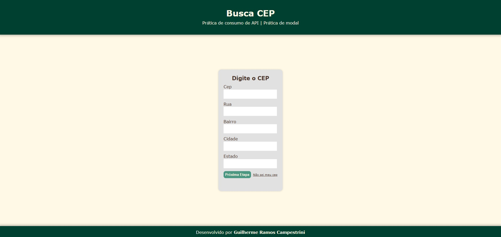

# busca-CEP 🔎🏡

Prática feita em JavaScript para consumo de API. Durante o projeto a ideia de um modal surgiu e aproveitei para aprender e colocar em prática.

---

## 💻 Funcionalidades

- 🔍 Busca de endereço por CEP
- 🔍 Busca de CEP por endereço
- ⚙ Exibição de informações em um modal

## 📚 Tecnologias utilizadas

- HTML5
- CSS3
- JavaScript (ES6+)
- API pública [ViaCEP](https://viacep.com.br/)

## 🧠 Aprendizados

- Manipulação de DOM
- Criação e controle de modal
- Consumo de API com `fetch`
- Função assíncrona `async` e `await`
- Tratamentos de erros
- Experiência do usuário

## 🖼️ Demonstração

## 🤝 Contato

Desenvolvido por Guilherme Ramos Campestrini

[GitHub](https://github.com/guicampe) | [LinkedIn](https://www.linkedin.com/in/guilhermeramoscampestrini/)